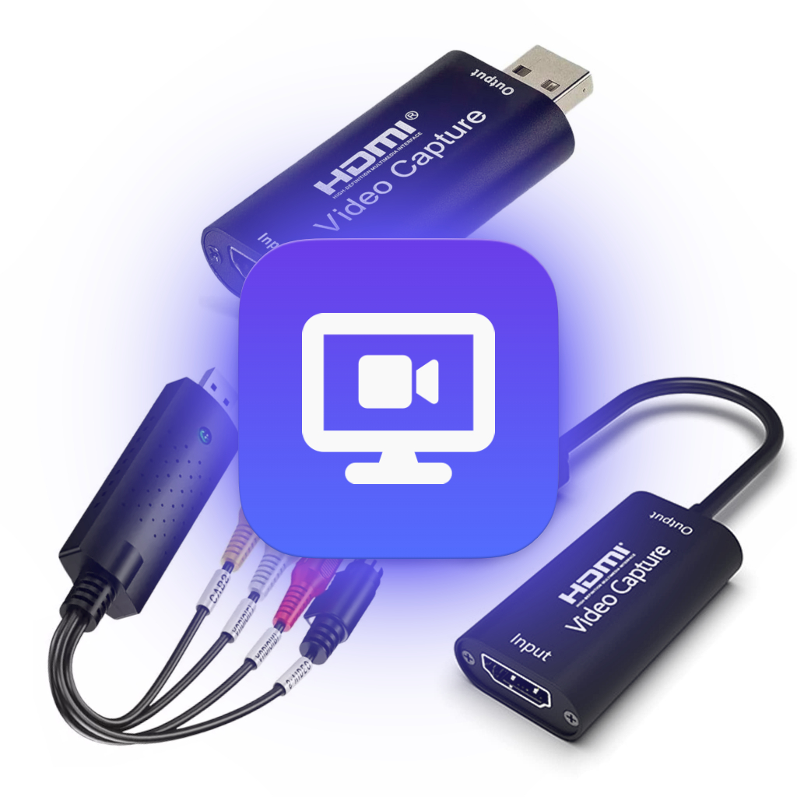
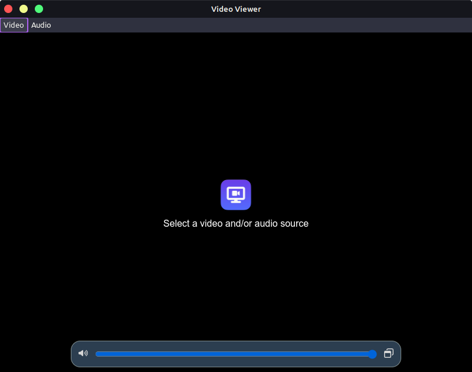

# Video Viewer
### Your solution for viewing EasyCap, HDMI Video Capture and any other video devices on your PC


This project has born from a personal need to use with EasyCap, for playing my SNES within my desktop without dropping from my OS connecting it directly to my monitor with some SNES to HDMI adapter. Now I can just open a program, turn on my SNES and play any game while watching a movie, a video or just during my working time (please don't do this).

It works very well also with some HDMI to USB devices, tested with a generic one with my Xbox Series S too. And it should work very well with any other video capture device too (such as webcams, cameras etc).

## Features


- You can select between any connected video and audio inputs (and make crazy combinations too)
- Support up to FullHD 60fps
- Support stereo 2-channel audio input
- Fullscreen toggling in F11 key (or in Video > Toggle Fullscreen menu)
- Integrated volume control (shows when you move your mouse to the bottom of the window)
- Support for PIP (Picture In Picture)
- Multiplatform support (Windows and Linux, and macOS builds are welcome too)
- Simple for developers (it uses web technologies with Electron)

## Download

You can [download the latest build](https://github.com/rbfraphael/video-viewer/releases/latest) for Windows (portable, zipped and installer) and Linux (deb and AppImage) from the releases page. If you're on macOS and want to give it a try, you can compile it yourself just running ```npm install```, to install dependencies, then ```npm run build``` (remember you must have NodeJS installed on your machine). It should build a usable version for macOS at the **dist** folder.
